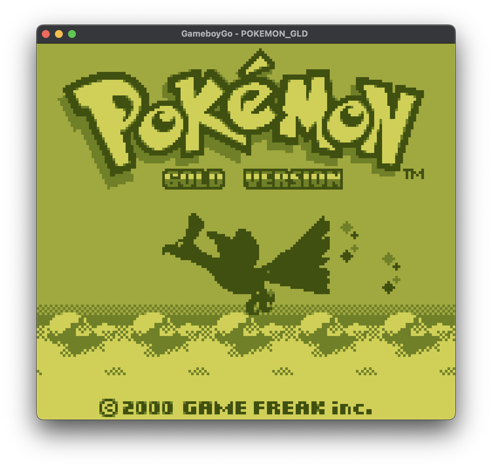
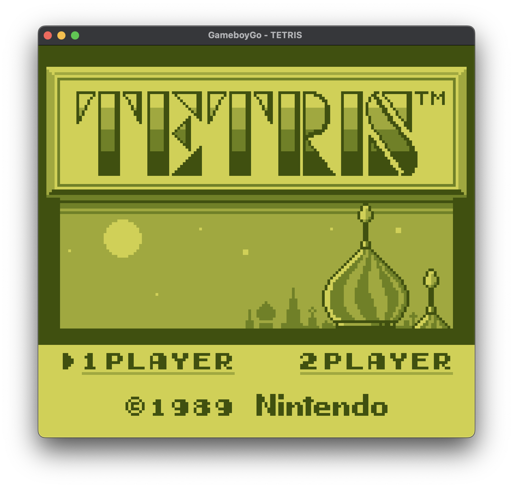
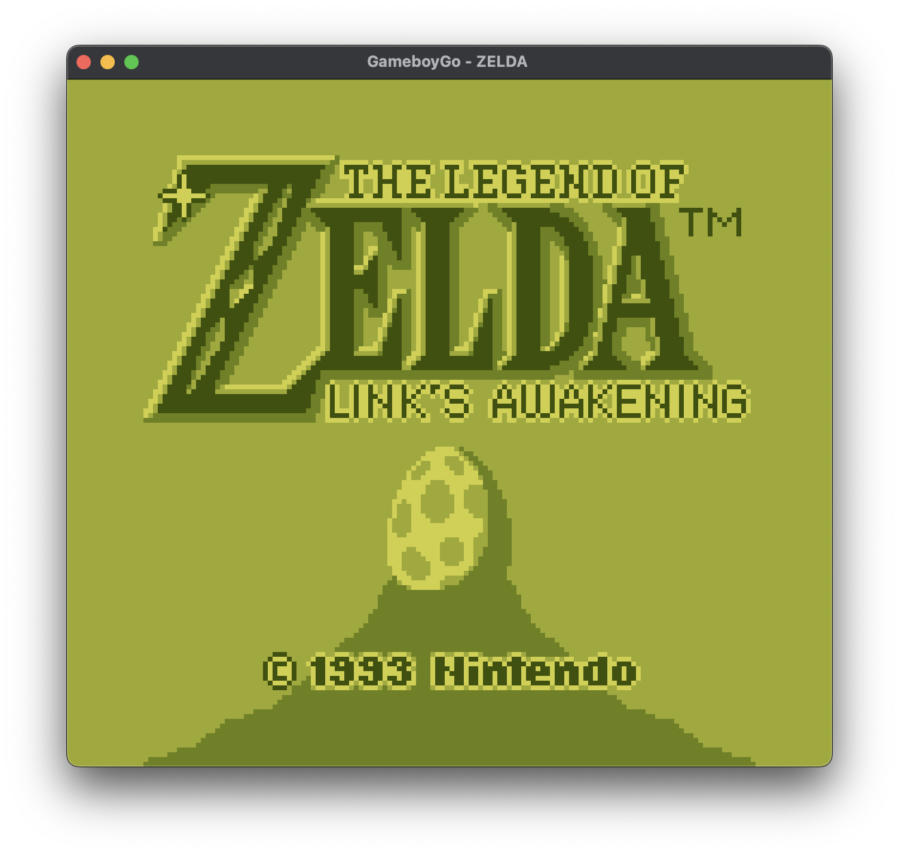
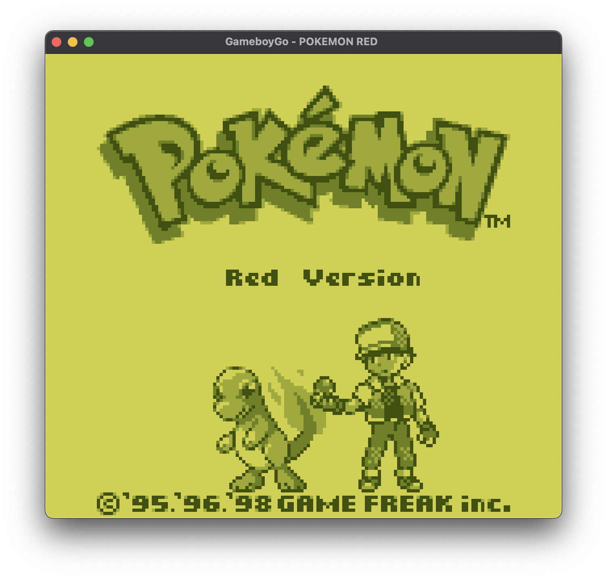
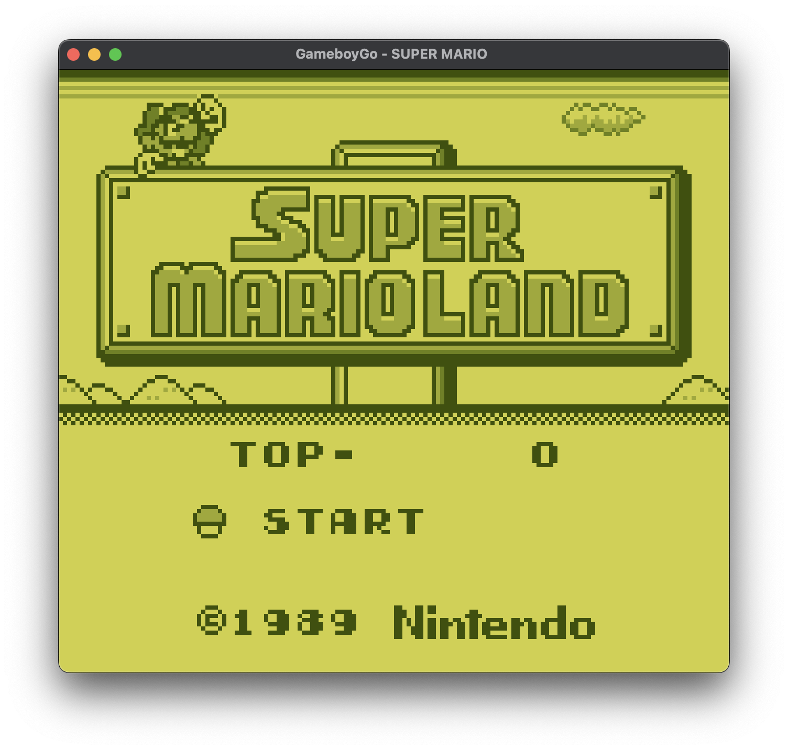
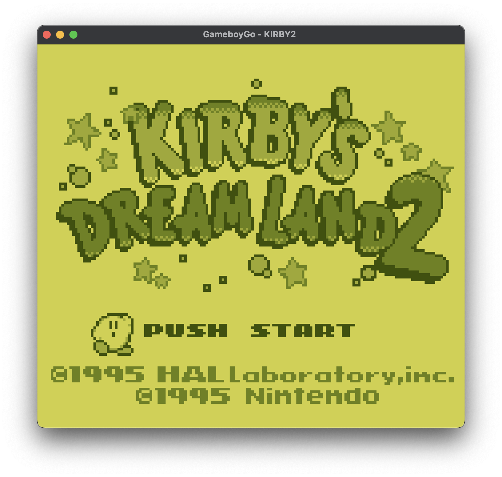
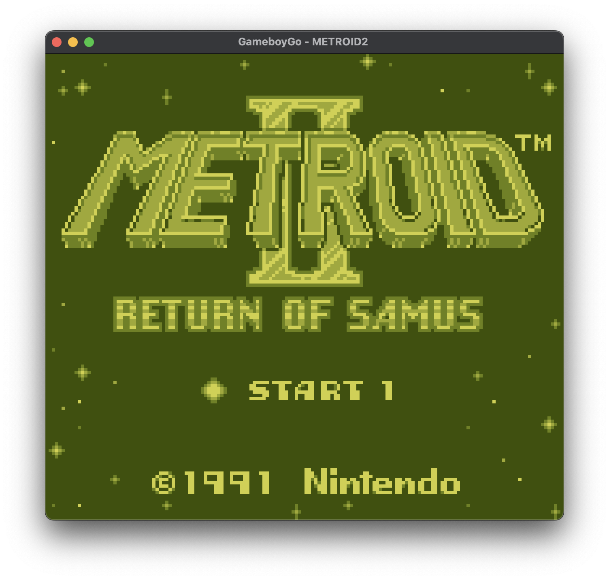
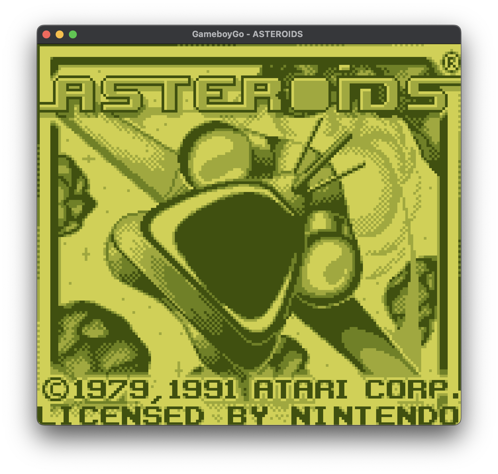
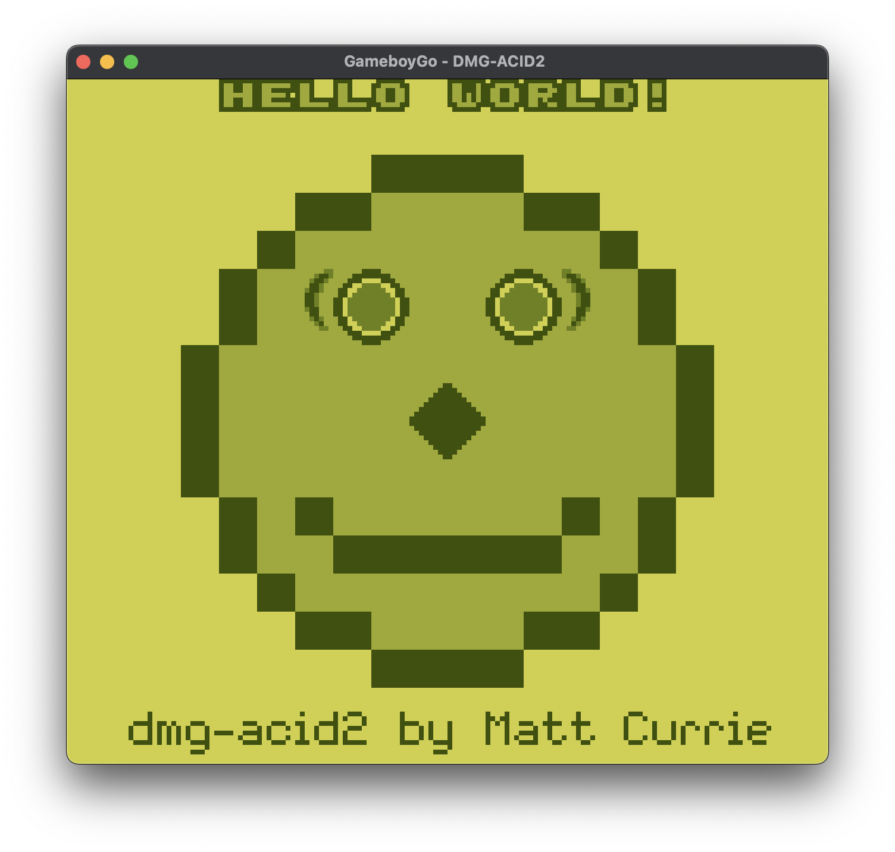

<a name="readme-top"></a>

[![Contributors][contributors-shield]][contributors-url]
[![Forks][forks-shield]][forks-url]
[![Stargazers][stars-shield]][stars-url]
[![Issues][issues-shield]][issues-url]
[![MIT License][license-shield]][license-url]
[![LinkedIn][linkedin-shield]][linkedin-url]

## GameboyGo

<!-- TABLE OF CONTENTS -->
<Details>
    <summary>Table of Contents</summary>
    <ol>
        <li>
            <a href="#about-the-project">About The Project</a>
            <ul>
            <li><a href="#built-with">Built With</a></li>
            </ul>
        </li>
        <li>
            <a href="#getting-started">Getting Started</a>
            <ul>
            <li><a href="#prerequisites">Prerequisites</a></li>
            <li><a href="#installation">Installation</a></li>
            </ul>
        </li>
        <li>
            <a href="#usage">Usage</a>
            <ul>
                <li><a href="#controls">Controls</a></li>
                <li><a href="#saving">Saving</a></li>
            </ul>
        </li>
        <li><a href="#testing">Testing</a></li>
        <li><a href="#features">Features</a></li>
        <li><a href="#license">License</a></li>
        <li><a href="#resources">Resources</a></li>
    </ol>
</details>


### About The Project

GameboyGo is a cross-platform Nintendo Gameboy emulator written in Go. This emulator aims for instruction accuracy and leverages Ebiten for handling 2D graphics and keyboard input. I developed GameboyGo as a hobby to learn the basics of low-level emulation development to re-create the nostalgic experience of playing classic Nintendo games.

<div style="display: flex; flex-wrap: wrap;">
    
    
    
    
    
    
    
    
</div>

<p align="right">(<a href="#readme-top">back to top</a>)</p>


### Built With

* [![Golang][Golang]][Golang-url]
* <a href="https://ebitengine.org">Ebiten</a>

<p align="right">(<a href="#readme-top">back to top</a>)</p>


<!-- GETTING STARTED -->
## Getting Started

### Prerequisites

1. Install Go (Golang):
    * Make sure you have Go installed on your machine. If you don't have Go installed, you can download and install it from the [official Go website](https://go.dev/doc/install).

    * Verify the installation by opening your terminal and running:
        ```sh
        go version
        ```

2. Install Git:
    * Ensure you have Git installed to clone the repository. You can download and install Git from the [official Git website](https://git-scm.com/book/en/v2/Getting-Started-Installing-Git).

    * Verify the installation by opening your terminal and running:
        ```sh
        git --version
        ```

3. Install a C Compiler (required only for macOS and Linux):
    * Ensure you have a C compiler installed on your machine since Ebiten uses both Go and C. You can follow a guide from the [official Ebiten website](https://ebitengine.org/en/documents/install.html?os=darwin) to download and install a C compiler.

    * Verify the installation by opening your terminal and running depending on your C compiler:
        ```sh
        gcc --version
        ```
        or
        ```sh
        clang --version
        ```

### Installation

1. Clone the repository
   ```sh
   git clone https://github.com/BeralaWoolies/GameboyGo.git <Repo-Directory>
   ```
2. Navigate into the cloned repository
   ```sh
   cd <Repo-Directory>
   ```
3. Build the emulator by running:
   ```sh
   go build -o GameboyGo ./cmd/main/main.go
   ```
    * If building on Windows Subsystem for Linux (WSL) then instead run:
        ```sh
        GOOS=windows go build -o GameboyGo ./cmd/main/main.go
        ```

<p align="right">(<a href="#readme-top">back to top</a>)</p>


<!-- USAGE EXAMPLES -->
## Usage

Simplest way to run the emulator:
```sh
./GameboyGo -rom <rom-name.gb>
```

To run the emulator with a user-provided boot rom:
```sh
./GameboyGo -rom <rom-name.gb> -bootrom <boot-rom.bin>
```

All options:
```
    -rom
        must specify a .gb or .gbc rom
    -bootrom
        optionally specify a boot rom to play
    -stats
        optionally enable fps and emu speed tracking
    -d
        optionally enable debug mode
    -cpuprofile
        write cpu profile to `file`
    -memprofile
        write memory profile to `file`
```

### Controls

| Keyboard             | Joypad        |
| -------------------- | ------------- |
| <kbd>&uarr;</kbd>    | &uarr; button |
| <kbd>&darr;</kbd>    | &darr; button |
| <kbd>&rarr;</kbd>    | &rarr; button |
| <kbd>&larr;</kbd>    | &larr; button |
| <kbd>A</kbd>         | A button      |
| <kbd>S</kbd>         | B button      |
| <kbd>Enter</kbd>     | Start button  |
| <kbd>Space</kbd>     | Select button |

### Saving
If the loaded rom supports battery backed saves, a `<rom-name>.sav` (e.g `pokemon-gold.sav`) file containing the cartridge RAM dump is created under the directory `./saves/`. The emulator maps `<rom-name>.sav` into main memory during runtime allowing all RAM writes to be flushed into the `.sav` file eventually.

<p align="right">(<a href="#readme-top">back to top</a>)</p>


## Testing
### CPU
GameboyGo passes all individual [Blargg's](https://github.com/retrio/gb-test-roms/tree/master/cpu_instrs/individual) cpu instruction test roms.

### PPU
GameboyGo passes [`dmg-acid2.gb`](https://github.com/mattcurrie/dmg-acid2) which tests for correct sprite, background and window rendering. It also tests for correct LCD scrolling,
palettes, sprite priority and sprite flipping.



### Memory Bank Controllers
GameboyGo passes all tests in `./tests/mbc1` (except for `multicart_rom_8Mb.gb`) and `./tests/mbc3`.


<!-- FEATURES -->
## Features

- [x] CPU
    - [x] All 512 CPU instructions
- [x] PPU
    - [x] Sprite rendering
    - [x] Background rendering
    - [x] Window rendering
    - [x] LCD scrolling
    - [x] Palettes
    - [x] OAM transfer
- [ ] APU
- [x] DMA
- [x] Interrupts
    - [x] VBLANK interrupts
    - [x] Joypad interrupts
    - [x] Timer interrupts
    - [x] STAT interrupts
    - [x] Serial interrupts
- [x] Joypad Input
- [x] Battery backed saves
- [ ] Serial Data Transfer (stubbed)
- [ ] Memory Bank Controllers
    - [x] MBC1
    - [x] MBC3
        - [ ] RTC (Real Time Clock) implementation
    - [ ] MBC5

<div style="display: flex; flex-wrap: wrap; gap: 10px">
    
    
    
    
</div>

<p align="right">(<a href="#readme-top">back to top</a>)</p>


<!-- LICENSE -->
## License

Distributed under the MIT License. See `LICENSE` for more information.

<p align="right">(<a href="#readme-top">back to top</a>)</p>


<!-- RESOURCES -->
## Resources
Interested in writing a Gameboy emulator or just emulation development in general? Feel free to draw inspiration from this repo and also check out these amazing resources that helped me build GameboyGo.
* The Nintendo Gameboy is notorious for many edge cases and obscure behaviour. I highly recommend checking out the [Emulator Development Discord server](https://discord.com/invite/dkmJAes) if you are unsure about how to emulate certain parts of the Gameboy.
* https://github.com/Humpheh/goboy/tree/master - another great Gameboy emulator written in Go to use for reference
* https://gbdev.io/pandocs/single.html - in-depth Gameboy documentation
* https://github.com/AntonioND/giibiiadvance/blob/master/docs/TCAGBD.pdf - in-depth Gameboy documentation
* https://gbdev.io/gb-opcodes/optables/ - CPU opcode table
* https://blog.tigris.fr/category/emulator/ - great for understanding the Gameboy functionality
* https://emudev.de/gameboy-emulator/overview/ - great for understanding the Gameboy functionality and emulation in general
* https://axleos.com/writing-axles-gameboy-emulator/ - great for understanding the boot rom
* https://hacktix.github.io/GBEDG/ - great for understanding the Gameboy PPU (specifically the pixel FIFO)

<p align="right">(<a href="#readme-top">back to top</a>)</p>


[contributors-shield]: https://img.shields.io/github/contributors/BeralaWoolies/GameboyGo.svg?style=for-the-badge
[contributors-url]: https://github.com/BeralaWoolies/GameboyGo/graphs/contributors
[forks-shield]: https://img.shields.io/github/forks/BeralaWoolies/GameboyGo.svg?style=for-the-badge
[forks-url]: https://github.com/BeralaWoolies/GameboyGo/network/members
[stars-shield]: https://img.shields.io/github/stars/BeralaWoolies/GameboyGo.svg?style=for-the-badge
[stars-url]: https://github.com/BeralaWoolies/GameboyGo/stargazers
[issues-shield]: https://img.shields.io/github/issues/BeralaWoolies/GameboyGo.svg?style=for-the-badge
[issues-url]: https://github.com/BeralaWoolies/GameboyGo/issues
[license-shield]: https://img.shields.io/github/license/BeralaWoolies/GameboyGo.svg?style=for-the-badge
[license-url]: https://github.com/BeralaWoolies/GameboyGo/blob/master/LICENSE
[linkedin-shield]: https://img.shields.io/badge/-LinkedIn-black.svg?style=for-the-badge&logo=linkedin&colorB=555
[linkedin-url]: https://linkedin.com/in/clarke-tran-9a2721269
[Golang]: https://img.shields.io/badge/Go-00ADD8?style=for-the-badge&logo=go&logoColor=white
[Golang-url]: https://go.dev
[Ebiten-url]: https://ebitengine.org
[Ebiten]: https://ebitengine.org/images/logo.png
